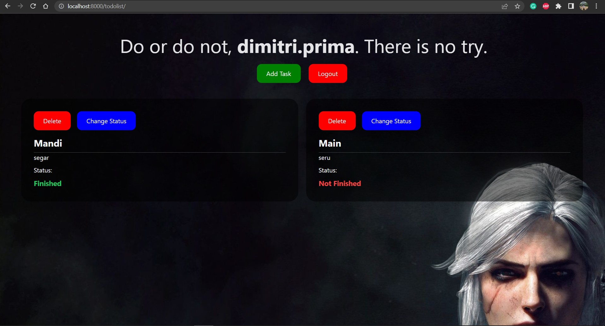

# Tugas 6

### [Link Deployment](https://tutu-2.herokuapp.com/todolist/login)

## Perbedaan antara asynchronous programming dengan synchronous programming.
Asynchronus: proses jalannya program bisa dilakukan secara bersamaan tanpa harus menunggu proses antrian. Di sini user bisa terus berinteraksi saat nunggu respons dari server, jadi tidak nunggu halamannya selesai. Contohnya seperti chat dan email.

Synchronus: proses jalannya program secara sequential , disini yang dimaksud sequential ada berdasarkan antrian ekseskusi program. Jadi saat user click atau mengirim request, user harus menunggu server menampilkan semuanya dahulu, baru bisa berinteraksi lagi. Contohnya saat kita klik ketik sesuatu di kolom pencarian google dan enter, kita harus menunggu google menampilkan semua informasi yang ada, baru bisa berinteraksi lagi.

## Dalam penerapan JavaScript dan AJAX, terdapat penerapan paradigma Event-Driven Programming. Jelaskan maksud dari paradigma tersebut dan sebutkan salah satu contoh penerapannya pada tugas ini.
Event-Driven Programming adalah suatu paradigma pemrograman yang alur programnya ditentukan oleh suatu event/peristiwa yang merupakan keluaran atau tindakan pengguna atau bisa berupa pesan dari program lainnya. Contohnya pada penerapan tugas ini ialah ketika melakukan perintah tambah task.

## Jelaskan penerapan asynchronous programming pada AJAX.
1. Saat user pada client memiliki sebuah event atau permintaan ke server, maka event dari user ini akan ditampung ke mesin Ajax
2. Mesin Ajax ini akan menampung semua event dari user dan melakukan transfer data
3. Data ini kemudian diproses secara server-side dengan metode asynchronous
4. Hasil dari proses data ini akan kemudian akan mengupdate halaman website secara langsung
5. Tidak perlu adanya refresh lagi dari user

## Jelaskan bagaimana cara kamu mengimplementasikan checklist di atas.
1. Membuat fungsi `show_json` pada `views.py` untuk return data yang dibuat oleh user:
   ```
   def show_json(request):
        data_tasks = MyToDoList.objects.filter(user=request.user)
        data = serializers.serialize('json', data_tasks)
        return HttpResponse(data, content_type='application/json')
   ```

2. Membuat routing untuk fungsi tersebut didalam file `urls.py`:
   ```
   urlpatterns = [    
        ...
        path('json/', show_json, name='show_json'),
        ...
    ]
   ```

3. membuat fungsi `add_task_ajax` pada `views.py`:
   ```
   def add_task_ajax(request):
        if request.method == 'POST':
            title = request.POST.get('title')
            description = request.POST.get('description')
            todo = MyToDoList.objects.create(title=title, description=description,date=datetime.date.today(), is_finished=False, user=request.user)

            result = {
                'fields':{
                    'title':todo.title,
                    'description':todo.description,
                    'is_finished':todo.is_finished,
                    'date':todo.date,
                },
                'pk':todo.pk
            }
            return JsonResponse(result)
    ```

4. Membuat routing untuk fungsi tersebut didalam file `urls.py`:
   ```
   urlpatterns = [    
        ...
        path('add/', add_task_ajax, name='add_task_ajax'),
        ...
    ]

5. Kemudian mengedit `todolist.html` dengan menggunakan fungsi yang sudah dibuat dan merapikan tampilannya.
   

6. Terakhir push kembali ke github untuk deployment ke Heroku.


##### _Dimitri Prima Nugraha | 2106750396 | PBP-F_