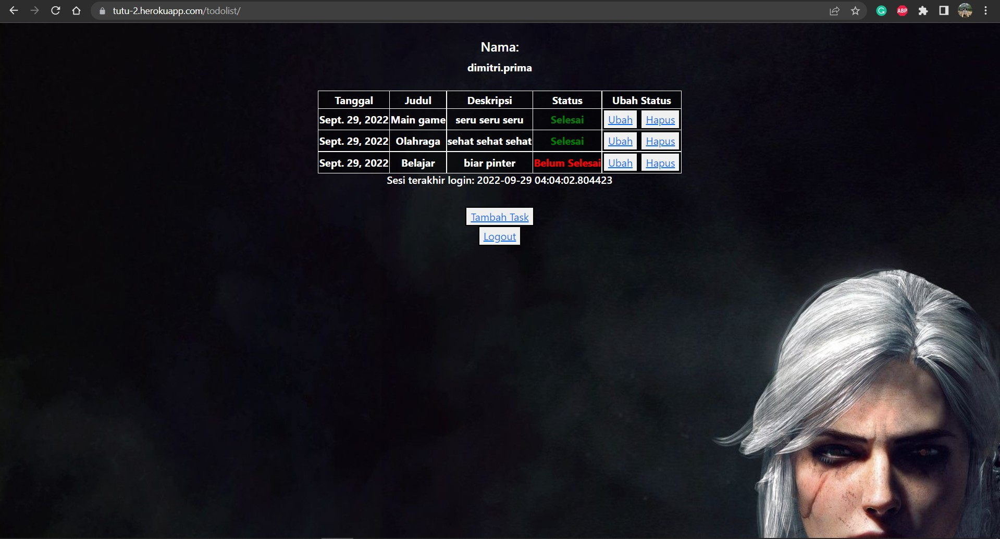

# Tugas 5

### [Link Deployment](https://tutu-2.herokuapp.com/todolist/login)

## Perbedaan dari Inline, Internal, dan External CSS? Apa saja kelebihan dan kekurangan dari masing-masing style?
Inline CSS: kode CSS yang ditulis langsung pada atribut elemen HTML. Kelebihan dari menggunakan Inline CSS ini ialah sangat membantu ketika hanya ingin menguji dan melihat suatu perubahan pada satu elemen, proses load lebih cepat karena permintaan HTTP yang lebih kecil, dan sangat berguna untuk memperbaiki kode dengan cepat. Kekurangan dari menggunakan Inline CSS ini adalah tidak efisien karena Inline CSS hanya bisa diterapkan pada satu elemen HTML.

Internal CSS: kode CSS yang ditulis di dalam tag <style> dan kode HTML dituliskan di bagian header file HTML. Keuntungan dari menggunakan Internal CSS ini ialah tidak perlu melakukan upload beberapa file karena HTML dan CSS berada dalam satu file. Kekurangannya ialah tidak efisien jika ingin menggunakan CSS yang sama dalam beberapa file dan membuat performa lebih lama karena CSS ang berbeda-beda akan mengakibatkan loading ulang setiap kali ganti halaman.

External CSS: kode CSS yang ditulis terpisah dengan kode HTML dan biasanya ditulis di sebuah file khusus yang berekstensi _.css_. Kelebihan External CSS ini ialah ukuran file HTML akan menjadi lebih kecil dan struktur dari kode HTML jadi lebih rapi, loading website menjadi lebih cepat, dan file CSS dapat digunakan di beberapa halaman website sekaligus. Kekurangannya ialah halaman akan menjadi berantakan, ketika file CSS gagal dipanggil oleh file HTML, biasanya diakibatkan oleh koneksi internet yang lama.

## Tag HTML5
1. `<!DOCTYPE>`, digunakan untuk menentukan tipe dokumen
2. `<html>`, digunakan untuk membuat dokumen HTML
3. `<title>`, digunakan untuk judul suatu page
4. `<p>`, digunakan untuk menuliskan paragraf pada page
5. `<h1>...<h6>`, digunakan untuk heading suatu page
6. `<br>`, digunakan untuk membuat baris kosong
7. `<!--...-->`, digunakan untuk menuliskan komen
8. `<form>`, digunakan untuk membuat form input bagi user
9. `<input>`, digunakan untuk input user
10. `<button>`, digunakan untuk tombol yang dapat di klik user

## Tipe-tipe CSS selector
1. Tag Selector: menggunakan tag HTML sebagai selectornya.
2. ID Selector: menggunakan atribut “id” pada element HTML sebagai selectornya.
3. Class Selector: menggunakan atribut “class” pada element HTML sebagai selectornya.
4. Universal Selector: menggunakan tanda bintang "*" pada CSS dan bertujuan untuk ‘mencari’ semua tag yang ada.
5. Attribute Selector: digunakan untuk mencari seluruh tag yang memiliki atribut yang dituliskan.

## Implementasi Tugas 5
1. Membuka file html yang telah dibuat pada tugas 4 kemarin kemudian edit sesuai dengan perintah tugas.
2. Pertama pada file `login.html`, menambahkan _bootstrap_, kemudian buat style sesuai yang diinginkan (meliputi warna font, warna background, dan margin).
3. Pada file `register.html`, menambahkan _bootstrap_ juga, kemudian membuat styling sesuai yang diinginkan (meliputi warna font, warna background, dan margin).
4. Pada file `add_task.html`, menambahkan _bootstrap_ juga, kemudian membuat styling sesuai yang diinginkan (meliputi warna font, warna background, dan margin).
5. Pada file `todolist.html`, juga menambahkan _bootstrap_, kemudian membuat styling sesuai yang diinginkan (meliputi warna font, warna background, dan margin), menambahkan _navigation bar_, dan juga mengubah bentuk tampilan tabel pada tugas 4 kemarin menjadi _cards_.
6. Setelah selesai _styling_, push kembali ke github yang nantinya akan ter-_deploy_ ke Heroku.


# Tugas 4

### [Link Deployment](https://tutu-2.herokuapp.com/todolist/login)

## Apa kegunaan `` pada elemen `<form>`? Apa yang terjadi apabila tidak ada potongan kode tersebut pada elemen `<form>`?
CSRF Token (Cross Site Request Forgery Token) merupakan sebuah random string yang di-generate setiap kali halaman form muncul. Token tersebut memiliki variasi yang unik, acak, serta memiliki nilai yang besar sehingga menjadikannya rumit untuk diretas oleh _hacker_ atau peretas. Jika tidak terdapat potongan kode tersebut pada elemen `<form>`, maka peretas dapat melakukan hal-hal yang tidak diinginkan melalui link atau HTTP _request_.

## Apakah kita dapat membuat elemen `<form>` secara manual (tanpa menggunakan generator seperti `{{ form.as_table }}`)? Jelaskan secara gambaran besar bagaimana cara membuat `<form>` secara manual.
Ya, kita dapat membuat elemen `<form>` secara manual (tanpa menggunakan generator seperti `{{ form.as_table }}`). Contohnya semisal kita ingin menerima input password, maka kita dapat membuat elemen `<form>` dan men-declare secara eksplisit parameter atau input yang dinginkan seperti menuliskan `{{ form.password }}`.

## Jelaskan proses alur data dari submisi yang dilakukan oleh pengguna melalui HTML form, penyimpanan data pada _database_, hingga munculnya data yang telah disimpan pada template HTML.
1. Ketika form telah diisi dan tombol submit diklik oleh _user_, data akan dibawa oleh _request_ yang nantinya akan disimpan ke dalam suatu variabel oleh fungsi `views.py`.

2. Kemudian diinisiasikan objek baru sesuai dengan _request_ dari _user_. Lalu objek tersebut akan disimpan ke dalam _database_ menggunakan perintah `<objek>.save()`. Contohnya seperti:
   ```
   if request.method == "POST":
        form = UserCreationForm(request.POST)
        if form.is_valid():
            form.save()
   ```

3. Pengambilan objek dilakukan oleh `views.py` melalui `models.py` yang akan mengambil data yang sesuai dengan data _user_ dari _database_.

4. Setelah itu data yang tersimpan akan di-_render_ ke HTML untuk ditampilkan kepada _user_.

## Implementasi Tugas 4
1. Membuat folder todolist di dalam clone repository dengan menjalankan command `python manage.py startapp todolist` di terminal.

2. Melakukan routing path ke app `todolist` dengan `path('todolist/', include('todolist.urls'))` pada `project_django/urls.py`:
   ```
   urlpatterns = [
        ...
        path('todolist/', include('todolist.urls')),
    ]
   ```

3. Membuat model `MyToDoList` pada file `models.py` di dalam folder `todolist`:
   ```
   class MyToDoList(models.Model):
        user = models.ForeignKey(User, on_delete=models.CASCADE)
        date = models.DateField(null = False, blank = False, auto_now_add = True)
        title = models.CharField(max_length = 255)
        description = models.TextField()
        is_finished = models.BooleanField(default = False)
   ```

4. Membuat fungsi untuk `register`, `login`, dan `logout` pada `views.py` kemudian membuat bentuk HTML-nya:
   ```
   def register(request):
        form = UserCreationForm()

        if request.method == "POST":
            form = UserCreationForm(request.POST)
            if form.is_valid():
                form.save()
                messages.success(request, 'Akun telah berhasil dibuat!')
                return redirect('todolist:login_user')
        
        context = {'form':form}
        return render(request, 'register.html', context)
    ```
    ```
    def login_user(request):
        if request.method == 'POST':
            username = request.POST['username']
            password = request.POST['password']
            user = authenticate(request, username=username, password=password)
            if user is not None:
                login(request, user)
                response = HttpResponseRedirect(reverse('todolist:show_todolist'))
                response.set_cookie('last_login', str(datetime.datetime.now()))
                return response
            else:
                messages.info(request, 'Username atau Password salah!')
        context = {}
        return render(request, 'login.html', context)
    ```
    ```
    def logout_user(request):
        logout(request)
        response = HttpResponseRedirect(reverse('todolist:login_user'))
        response.delete_cookie('last_login')
        return response
    ```

5. Membuat fungsi `show_todolist`, `add_task`, `delete_task`, dan `update_task` pada `views.py` kemudian membuat bentuk HTML-nya:
   ```
   @login_required(login_url='/todolist/login/')
    def show_todolist(request):
        data_tasks = MyToDoList.objects.filter(user=request.user)
        context = {'data_tasks':data_tasks,
                'user' : request.user,
                'last_login': request.COOKIES['last_login'],}
        return render(request, 'todolist.html', context)
    ```
    ```
    @login_required(login_url='/todolist/login/')
    def add_task(request):
        form = TaskForm()
        if request.method == "POST":
            form = TaskForm(request.POST)
            if form.is_valid():
                instance = form.save(commit=False)
                instance.user = request.user
                instance.save()
                return redirect('todolist:show_todolist')
            
        context = {'form':form}
        return render(request, 'add_task.html', context)
    ```
    ```
    @login_required(login_url='/todolist/login/')
    def delete_task(request, task_id):
        task = MyToDoList.objects.get(id=task_id)
        if task:
            task.delete()
            return redirect('todolist:show_todolist')
        messages.error(request, 'Tidak dapat menghapus task!')
        return redirect('todolist:show_todolist')
    ```
    ```
    @login_required(login_url='/todolist/login/')
    def update_task(request, task_id):
        task = MyToDoList.objects.get(id=task_id)
        if task.is_finished:
            task.is_finished = False
        else:
            task.is_finished = True
        task.save()
        return redirect('todolist:show_todolist')
    ```

6. Membuat routing path pada file `urls.py` di folder `todolist`:
   ```
   urlpatterns = [    
        path('', show_todolist, name='show_todolist'),
        path('register/', register, name='register'),
        path('login/', login_user, name='login_user'),
        path('logout/', logout_user, name='logout_user'),
        path('create-task/', add_task, name='add_task'),
        path('delete-task/<int:task_id>/', delete_task, name='delete_task'),
        path('update-task/<int:task_id>/', update_task, name='update_task'),
    ]
    ```

7. Melakukan _push_ ke repositori dan _deployment_ ke Heroku. Lalu membuat 2 _user_ dan 3 _dummy data_ pada masing-masing _user_:
   
   .jpg)
